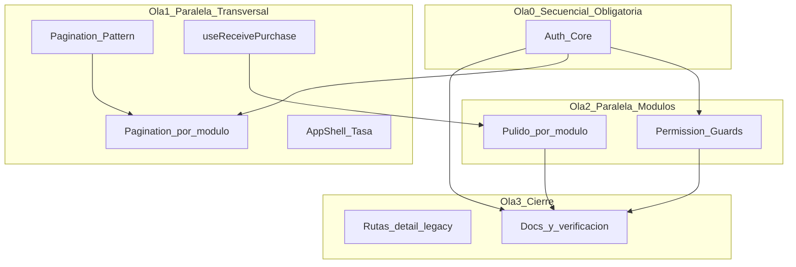
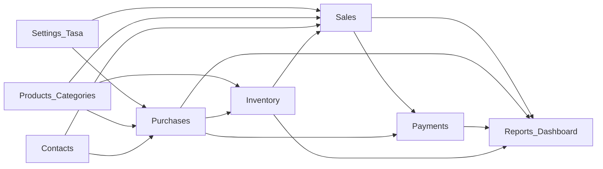

# Plan de integración paralela — control-ventas

## Diagnóstico actual

La integración de **datos de negocio ya está mayormente completa**: hooks TanStack Query, `apiFetch`, `PaginatedList`, rutas dinámicas `[id]`, mutaciones CRUD y flujos transaccionales (ventas, compras, pagos) conectados al BFF. El backend está validado por el e2e bodegón (15 fases) contra Supabase.

**Lo que falta no es “conectar módulos desde cero”, sino cerrar 4 capas transversales + pulido por módulo:**

| Capa | Estado | Impacto |
|------|--------|---------|
| Auth real (BFF + guards) | Backend listo; frontend en demo | Bloquea permisos reales y rutas protegidas |
| Paginación UI | Componente listo; 0 listados conectados | Solo primera página (`limit=10`) |
| Permisos en botones | Shell filtra menú; acciones sin guard | Depende de auth |
| Acciones secundarias | alerts/disabled/hooks faltantes | Por módulo; parcialmente bloqueado por API |



---

## Dependencias entre módulos (negocio)

Los flujos **transaccionales ya funcionan** en frontend; las dependencias importan para **orden de prueba** y para agentes que toquen create flows, no para bloquear trabajo paralelo de paginación.



| Módulo | Depende de (runtime) | Puede paralelizarse en |
|--------|----------------------|-------------------------|
| Dashboard | Ventas/inventario con datos | Ola 1 (filtros fechas) |
| Products / Categories | — | Ola 1–2 |
| Inventory | Products | Ola 1–2 |
| Contacts | — | Ola 1–2 |
| Purchases | Contacts, Products, Tasa | Ola 1–2 |
| Sales | Contacts, Products, Tasa, Stock | Ola 1–2 |
| Payments | Sales o Purchases | Ola 2 |
| Reports | Datos transaccionales | Ola 1 (paginación tablas) |
| Settings / Users | Auth (permisos admin) | Ola 2 tras auth |

**Auth es dependencia global** para: guards middleware, perfil en shell, permisos en botones, pruebas RBAC reales. **No bloquea** paginación UI ni hooks aislados (`useReceivePurchase`, wiring de tablas en contact detail).

---

## Ola 0 — Secuencial (1 agente, ~1 bloque)

**Agente: Auth Core** — debe terminar antes de permisos en botones y antes de pruebas RBAC.

Archivos clave:
- [`src/modules/auth/login/hooks/useLogin.ts`](src/modules/auth/login/hooks/useLogin.ts) → migrar a `POST /api/auth/login`
- Crear [`src/modules/auth/hooks/useCurrentUser.ts`](src/modules/auth/hooks/useCurrentUser.ts) → `GET /api/auth/me`
- Crear [`src/modules/auth/hooks/useLogout.ts`](src/modules/auth/hooks/useLogout.ts) → `POST /api/auth/logout`
- Refactor [`src/shared/components/AppShell/AuthenticatedAppShell.tsx`](src/shared/components/AppShell/AuthenticatedAppShell.tsx)
- Ampliar [`src/middleware.ts`](src/middleware.ts) — prefijos privados
- Handler 401 en [`src/lib/query/query-client.ts`](src/lib/query/query-client.ts)

Entregables:
1. Login único vía BFF (cookies alineadas con `requirePermission`)
2. Shell con loading / error / redirect si no hay sesión o `isActive: false`
3. Logout en `AppShell` limpia cache TanStack Query
4. Middleware protege: `/dashboard`, `/products`, `/sales`, `/purchases`, `/inventory`, `/contacts`, `/payments`, `/reports`, `/settings`
5. Tests Jest para hooks auth + shell básico

**Criterio de salida:** login con `admin@example.com`, navegar módulos sin `localStorage` demo, 403 real en API con rol incorrecto.

---

## Ola 1 — Paralela (5–6 agentes simultáneos)

Requiere **patrón compartido acordado** antes de spawn (15 min, agente líder o commit inicial):

### Patrón paginación (contrato compartido)

En [`src/lib/api/pagination.ts`](src/lib/api/pagination.ts) exportar tipo reutilizable:

```ts
export type PaginationParams = { skip?: number; limit?: number };
```

Cada hook de listado acepta `{ ...filters, skip, limit }` y cada página:

```tsx
const [skip, setSkip] = useState(0);
const [limit, setLimit] = useState(10);
// reset skip a 0 cuando cambian filtros
<Pagination skip={data?.skip ?? skip} limit={limit} total={data?.total ?? 0} ... />
```

**Importante:** en inventario, mover búsqueda client-side a query param `search` del API (hoy filtra solo la página actual).

| Agente | Alcance | Archivos principales | Depende de |
|--------|---------|---------------------|------------|
| **A — Paginación catálogo** | products, contacts, categories en filtros | `useProducts.ts`, `products-list/page.tsx`, `useContacts.ts`, `contacts-list/page.tsx` | Patrón paginación |
| **B — Paginación operaciones** | sales, purchases, payments | `useSales.ts`, `sales-list/page.tsx`, etc. | Patrón paginación |
| **C — Paginación inventario + settings** | inventory, movements, users, exchange rates | `useInventory.ts`, `settings-list/page.tsx` | Patrón paginación |
| **D — Paginación reportes + dashboard** | 10 report hooks + tablas dashboard | `useReports.ts`, `reports-list/page.tsx`, `dashboard/page.tsx` | Patrón paginación |
| **E — Compras (negocio)** | `useReceivePurchase`, botón recibir en list/detail, `status` en create, POST pago inicial | `usePurchases.ts`, `purchase-details/page.tsx`, `purchase-create/page.tsx` | API ya existe |
| **F — Shell tasa** | `useCurrentExchangeRate` en header | [`AppShell.tsx`](src/shared/components/AppShell/AppShell.tsx), layouts que pasan `refRateVes` | Ninguna |

**Conflictos de merge esperados:** ninguno entre A–D si cada agente toca módulos distintos; E y F son archivos aislados.

---

## Ola 2 — Paralela (6 agentes, tras Ola 0)

| Agente | Módulo | Trabajo restante | Bloqueado por API |
|--------|--------|------------------|-------------------|
| **G — Permisos UI (shared)** | Transversal | Hook `usePermission()` desde `useCurrentUser`; patrón `<Can permission="...">` o helper; aplicar en 2–3 pantallas como plantilla | Auth Ola 0 |
| **H — Products** | Productos | Desactivar vía `useUpdateProduct({ isActive: false })`; quitar `window.alert`; placeholder stock en detail | — |
| **I — Contacts** | Contactos | Wire `useContactSales/Purchases/Payments` en detail; desactivar vía `useUpdateContact` si API soporta `isActive` | DELETE contacto: **no existe** — usar PATCH |
| **J — Sales + Payments UX** | Ventas/Pagos | Quitar links demo; receipt UI o página dedicada; perm guards en create/cancel/pay | `useCancelPayment`: **sin endpoint** — dejar disabled documentado |
| **K — Inventory** | Inventario | Modal/detalle movimiento; link desde purchases receive corregido en Ola 1 | — |
| **L — Settings** | Config | Wire `useUpdateUser` en tabla usuarios (rol, isActive, grants) | Auth admin |

Agente **G** entrega el patrón; H–L lo aplican en sus módulos (evitar que 6 agentes inventen 6 estilos distintos).

---

## Ola 3 — Cierre (1 agente integrador)

1. **Rutas legacy:** redirigir `/products/detail`, `/contacts/detail`, `/sales/detail`, `/payments/detail`, `/purchases/detail` → `[id]` equivalente; eliminar enlaces internos
2. **Actualizar docs:** [`docs/frontend-integration-checklist.md`](docs/frontend-integration-checklist.md), marcar paginación/auth por módulo
3. **Verificación global:**
   - `npm run lint && npm run typecheck && npm test`
   - `npm run e2e:bodegon` (backend)
   - Smoke manual: login → crear venta → registrar pago → reporte
4. **Storybook:** 1 story por módulo con estado paginado (opcional, baja prioridad)

---

## Matriz: qué puede ir en multitasking y qué no

| Tarea | Paralelo | Prioridad previa |
|-------|----------|------------------|
| Auth core (login/me/logout/middleware) | **No** — 1 agente primero | — |
| Paginación por módulo | **Sí** — 4 agentes | Patrón compartido (commit inicial) |
| `useReceivePurchase` + create compra | **Sí** | Ninguna (API lista) |
| AppShell tasa | **Sí** | Ninguna |
| Permisos en botones | **Sí** por módulo | Auth Ola 0 + patrón G |
| Desactivar producto/contacto | **Sí** | Ninguna (PATCH) |
| Anular pago | **No implementar** | Requiere endpoint backend nuevo |
| DELETE contacto | **No implementar** | Requiere endpoint backend nuevo |
| Export reportes PDF/Excel | **Diferido** | Fuera de scope MVP |
| Wire hooks contact detail | **Sí** | Ninguna |

---

## Orden de ejecución recomendado (timeline)

```text
Día/sprint 1
  └─ Agente Auth (Ola 0) ──────────────────────────────┐
  └─ Agente líder: patrón paginación en products (1 PR) │ paralelo parcial
                                                       │
Día/sprint 2                                           ▼
  ├─ Agentes A,B,C,D,E,F (Ola 1) en paralelo
  └─ Agente G inicia patrón permisos cuando Auth merge

Día/sprint 3
  ├─ Agentes H,I,J,K,L (Ola 2) en paralelo
  └─ Agente integrador (Ola 3) al estabilizar merges

Verificación final: e2e + smoke RBAC (admin, vendedor, almacen, contador)
```

---

## Riesgos y mitigación

| Riesgo | Mitigación |
|--------|------------|
| Conflictos merge en hooks compartidos | Patrón paginación en PR pequeño primero; 1 módulo = 1 agente |
| Auth + demo mode (`ALLOW_DEMO_AUTH`) | Mantener demo solo en dev; documentar en [`auth-permissions.md`](docs/auth-permissions.md) |
| Paginación + filtros (skip no resetea) | Regla: `useEffect` reset `skip=0` al cambiar filtros |
| Inventario search client-side | Mover a query API en agente C |
| Agentes duplican lógica permisos | Agente G define `usePermission` antes de H–L |

---

## Definition of Done global

- Sesión real end-to-end sin `localStorage` demo en producción
- Todos los listados envían `skip`/`limit` y muestran `<Pagination />`
- Botones de acción críticos respetan permisos del perfil
- Compras: recibir pedido funciona; create puede elegir `pedido`/`recibido`
- Sin `window.alert` en acciones con API disponible
- Rutas `/detail` redirigen a `[id]`
- Checklist y guía API actualizados
- Tests + e2e bodegón verdes

---

## Backend opcional (track paralelo, no bloqueante MVP)

Si se quiere cerrar gaps documentados en [`docs/frontend-api-guide.md`](docs/frontend-api-guide.md):

- `DELETE` o `PATCH isActive` formal para contactos (hoy puede bastar PATCH)
- `DELETE /api/supplier-products/[id]`
- `PATCH /api/payments/[id]/cancel` para anular pagos
- Export reportes (fase posterior)

Estos pueden ir en un **agente Backend** en paralelo con Ola 2, pero **no bloquean** el cierre del MVP frontend descrito arriba.
