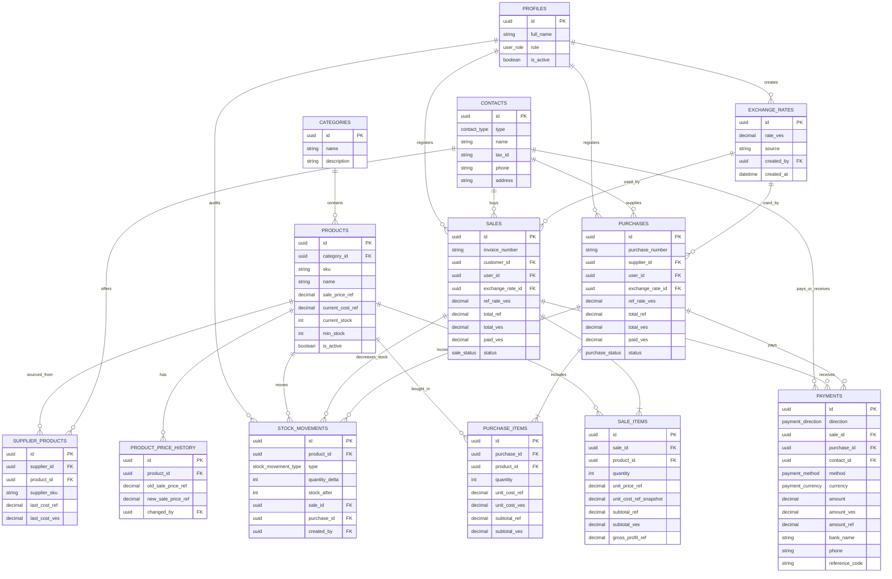

# Diseño de Base de Datos: ERP (PostgreSQL en Supabase)

Este documento detalla la estructura relacional para un ERP web usando Supabase como backend. El diseño prioriza ventas, compras, inventario, proveedores, clientes, historial de precios, costos y métricas de ganancia.

**Implementación SQL:** [`supabase/supabase-schema.sql`](../supabase/supabase-schema.sql)  
**Catálogo módulos ↔ tablas:** [`modules-catalog.md`](modules-catalog.md)  
**Última revisión doc:** julio 2026 (alineado con schema en repo).

La unidad base de precios será `ref`, equivalente operacional al valor de referencia en dólares. Los montos en VES se calculan con la tasa `ref_rate_ves` vigente al momento de la operación y se guardan como snapshot histórico para evitar que ventas o compras pasadas cambien cuando cambie la tasa.

## 1. Principios del Modelo

*   **Precios en ref:** Los productos se venden con precio base en `ref`.
*   **Tasa histórica:** Cada venta y compra guarda la tasa VES/ref usada en ese momento.
*   **Snapshots transaccionales:** Los detalles de venta y compra guardan precio/costo unitario, subtotal en `ref` y subtotal en VES.
*   **Inventario auditable:** El stock actual puede estar en `products.current_stock`, pero la fuente de verdad histórica son los movimientos en `stock_movements`.
*   **Ganancia real:** Las métricas deben comparar ventas contra costos históricos, no contra el costo actual del producto.
*   **Operaciones atómicas:** Ventas, compras, pagos y movimientos de stock deben crearse mediante funciones RPC o transacciones de PostgreSQL.

## 2. Tipos Enum Sugeridos

*   `user_role`: `superadmin`, `admin`, `vendedor`, `almacen`, `contador`
*   `store_status`: `active`, `paused`
*   `contact_type`: `cliente`, `proveedor`, `ambos`
*   `sale_status`: `borrador`, `pendiente_pago`, `pagada`, `cancelada`, `devuelta`
*   `purchase_status`: `pedido`, `recibido`, `cancelado`, `devuelto`
*   `payment_direction`: `entrada`, `salida`
*   `payment_method`: `efectivo_ves`, `efectivo_usd`, `pago_movil`, `punto_venta`, `transferencia`
*   `payment_currency`: `VES`, `USD`
*   `stock_movement_type`: `venta`, `compra`, `ajuste_entrada`, `ajuste_salida`, `devolucion_cliente`, `devolucion_proveedor`, `inventario_inicial`

## 3. Entidades y Atributos

### 3.0 Tiendas (`stores`)

Raíz de aislamiento multitienda. Ver [`multi-store-options.md`](multi-store-options.md).

*   `id`, `name`, `slug` (unique), `status` (`store_status`), `notes`, `created_by`, timestamps
*   Patch: `supabase/patches/20260716-multi-store.sql`
*   Las tablas de negocio llevan `store_id` NOT NULL (tras backfill de tienda `default`)

### 3.1 Perfiles (`profiles`)
Extensión de la tabla `auth.users` de Supabase para manejar roles y datos adicionales.

*   `id`: uuid (PK, references `auth.users`)
*   `full_name`: text
*   `role`: `user_role`
*   `store_id`: uuid (FK `stores`; **null solo si** `role = superadmin`)
*   `is_active`: boolean (default: true)
*   `granted_permissions`: jsonb (array de strings; overrides que agregan permisos)
*   `denied_permissions`: jsonb (array de strings; overrides que quitan permisos)
*   `created_at`: timestamp with time zone
*   `updated_at`: timestamp with time zone

Permisos efectivos en app: rol base + granted − denied (`admin` = todos los de tienda; `superadmin` = solo `platform.dashboard.view`, `platform.stores.*`, `platform.users.*` y `platform.reports.view`). Ver [`auth-permissions.md`](auth-permissions.md).

### 3.2 Configuración (`app_settings`)
Una fila por tienda (`store_id` unique).

*   `store_id`: uuid (PK/unique, FK `stores`)
*   `id`: smallint (legado; ya no es singleton global)
*   `business_name`: text
*   `default_tax_rate`: numeric(5,2)
*   `invoice_prefix`: text
*   `low_stock_threshold`: integer
*   `enabled_payment_methods`: `payment_method[]` (al menos 1; default todos)
*   `updated_at`: timestamptz
*   `updated_by`: uuid (FK `profiles`, nullable)

API: `GET`/`PATCH /api/settings`. Lectura liviana para POS: `GET /api/settings/payment-methods`.

### 3.3 Categorías (`categories`)

*   `id`: uuid (PK, default: `gen_random_uuid()`)
*   `store_id`: uuid (FK `stores`, not null)
*   `name`: text (not null)
*   `description`: text
*   `is_active`: boolean (default: true) — borrado lógico vía API DELETE
*   `created_at`: timestamp with time zone
*   `updated_at`: timestamp with time zone

### 3.4 Productos (`products`)

*   `id`: uuid (PK, default: `gen_random_uuid()`)
*   `category_id`: uuid (FK references `categories`)
*   `sku`: text (unique, index) - Código interno único.
*   `name`: text (not null)
*   `description`: text
*   `sale_price_ref`: decimal(12,2) (not null) - Precio actual de venta en `ref`.
*   `current_cost_ref`: decimal(12,2) - Costo referencial actual, derivado de la última compra o actualizado manualmente.
*   `current_stock`: integer (default: 0)
*   `min_stock`: integer (default: 5)
*   `image_url`: text
*   `is_active`: boolean (default: true)
*   `created_at`: timestamp with time zone
*   `updated_at`: timestamp with time zone

> Nota: `current_stock`, `sale_price_ref` y `current_cost_ref` son valores actuales para consulta rápida. El historial se obtiene desde `stock_movements`, `product_price_history` y `purchase_items`.

### 3.5 Historial de Tasas (`exchange_rates`)

Guarda el valor histórico del `ref` en VES.

*   `id`: uuid (PK, default: `gen_random_uuid()`)
*   `rate_ves`: decimal(14,4) (not null) - Valor de 1 `ref` expresado en VES.
*   `source`: text - Fuente o referencia de la tasa.
*   `notes`: text
*   `created_by`: uuid (FK references `profiles`)
*   `created_at`: timestamp with time zone

### 3.6 Historial de Precios de Venta (`product_price_history`)

Registra cambios del precio de venta en `ref`.

*   `id`: uuid (PK, default: `gen_random_uuid()`)
*   `product_id`: uuid (FK references `products`)
*   `old_sale_price_ref`: decimal(12,2)
*   `new_sale_price_ref`: decimal(12,2) (not null)
*   `reason`: text
*   `changed_by`: uuid (FK references `profiles`)
*   `created_at`: timestamp with time zone

### 3.7 Contactos (`contacts`)

Clientes y proveedores en una misma tabla diferenciados por tipo.

*   `id`: uuid (PK, default: `gen_random_uuid()`)
*   `type`: `contact_type`
*   `name`: text (not null)
*   `tax_id`: text (RIF/Cedula/NIT, unique nullable)
*   `email`: text
*   `phone`: text
*   `address`: text
*   `notes`: text
*   `is_active`: boolean (default: true)
*   `created_at`: timestamp with time zone
*   `updated_at`: timestamp with time zone

### 3.8 Productos por Proveedor (`supplier_products`)

Relación entre proveedores y productos, incluyendo último costo conocido y metadatos de catálogo.

*   `id`: uuid (PK, default: `gen_random_uuid()`)
*   `supplier_id`: uuid (FK references `contacts`)
*   `product_id`: uuid (FK references `products`)
*   `supplier_sku`: text
*   `last_cost_ref`: decimal(12,2)
*   `last_cost_ves`: decimal(14,2)
*   `last_purchased_at`: timestamp with time zone
*   `notes`: text — observaciones de la relación (SKU alternativo, condiciones, etc.)
*   `is_active`: boolean (default: true) — baja lógica; `false` oculta en catálogos operativos con filtro "Solo activos"
*   `created_at`: timestamp with time zone
*   `updated_at`: timestamp with time zone

**Índices:** `(supplier_id)`, `(product_id)`, `(is_active)`.

**RPC de escritura:**

| RPC | Uso |
|-----|-----|
| `register_supplier_product_price(...)` | Registrar cotización/ajuste; append historial + actualizar snapshot; retorna `variation_percent` |
| `deactivate_supplier_product(p_id)` | Baja lógica (`is_active = false`) sin borrar historial |
| `create_purchase` / `receive_purchase` | Al recibir compra, upsert snapshot + append historial con `origin = compra` |

### 3.8.1 Historial de precios proveedor-producto (`supplier_product_price_history`)

Auditoría de cambios de costo por par proveedor-producto.

*   `id`: uuid (PK, default: `gen_random_uuid()`)
*   `supplier_product_id`: uuid (FK references `supplier_products` on delete cascade)
*   `old_cost_ref`: decimal(12,2) — null en primer registro
*   `new_cost_ref`: decimal(12,2) (not null)
*   `old_cost_ves`: decimal(14,2)
*   `new_cost_ves`: decimal(14,2)
*   `origin`: text — `cotizacion` \| `compra` \| `ajuste` \| `vinculacion`
*   `changed_by`: uuid (FK references `profiles`)
*   `notes`: text
*   `created_at`: timestamp with time zone

**Índice:** `(supplier_product_id, created_at desc)`.

**Variación:** calculada en API/mapper: `(new - old) / old * 100` cuando `old_cost_ref > 0`.

**RLS:** SELECT autenticados; INSERT admin/almacén (escritura principal vía RPC `security definer`).

**Migración remota:** ejecutar ALTER + CREATE TABLE + RPCs desde `supabase/supabase-schema.sql` en el SQL Editor de Supabase (no auto-deploy).

### 3.9 Ventas (`sales`)

Cabecera de factura o recibo de venta.

*   `id`: uuid (PK, default: `gen_random_uuid()`)
*   `invoice_number`: text (unique, index)
*   `customer_id`: uuid (FK references `contacts`)
*   `user_id`: uuid (FK references `profiles`) - Usuario que registró la venta.
*   `exchange_rate_id`: uuid (FK references `exchange_rates`)
*   `ref_rate_ves`: decimal(14,4) (not null) - Snapshot de la tasa usada.
*   `subtotal_ref`: decimal(14,2) (default: 0)
*   `discount_ref`: decimal(14,2) (default: 0)
*   `tax_ref`: decimal(14,2) (default: 0)
*   `total_ref`: decimal(14,2) (default: 0)
*   `total_ves`: decimal(14,2) (default: 0)
*   `paid_ves`: decimal(14,2) (default: 0)
*   `status`: `sale_status`
*   `notes`: text
*   `created_at`: timestamp with time zone
*   `updated_at`: timestamp with time zone

### 3.10 Detalles de Venta (`sale_items`)

Detalle de productos vendidos. Los precios se copian al momento de facturar.

*   `id`: uuid (PK, default: `gen_random_uuid()`)
*   `sale_id`: uuid (FK references `sales` on delete cascade)
*   `product_id`: uuid (FK references `products`)
*   `quantity`: integer (not null, check `quantity > 0`)
*   `unit_price_ref`: decimal(12,2) (not null)
*   `unit_cost_ref_snapshot`: decimal(12,2) - Costo histórico estimado/usado para calcular margen.
*   `subtotal_ref`: decimal(14,2) (generated: `quantity * unit_price_ref`)
*   `subtotal_ves`: decimal(14,2)
*   `gross_profit_ref`: decimal(14,2) - `(unit_price_ref - unit_cost_ref_snapshot) * quantity`

### 3.11 Compras (`purchases`)

Cabecera de orden o factura de compra.

*   `id`: uuid (PK, default: `gen_random_uuid()`)
*   `purchase_number`: text (unique, index)
*   `supplier_id`: uuid (FK references `contacts`)
*   `user_id`: uuid (FK references `profiles`)
*   `exchange_rate_id`: uuid (FK references `exchange_rates`)
*   `ref_rate_ves`: decimal(14,4) (not null)
*   `subtotal_ref`: decimal(14,2) (default: 0)
*   `discount_ref`: decimal(14,2) (default: 0)
*   `tax_ref`: decimal(14,2) (default: 0)
*   `total_ref`: decimal(14,2) (default: 0)
*   `total_ves`: decimal(14,2) (default: 0)
*   `paid_ves`: decimal(14,2) (default: 0)
*   `status`: `purchase_status`
*   `notes`: text
*   `created_at`: timestamp with time zone
*   `updated_at`: timestamp with time zone

### 3.12 Detalles de Compra (`purchase_items`)

Detalle de productos comprados al proveedor.

*   `id`: uuid (PK, default: `gen_random_uuid()`)
*   `purchase_id`: uuid (FK references `purchases` on delete cascade)
*   `product_id`: uuid (FK references `products`)
*   `quantity`: integer (not null, check `quantity > 0`)
*   `unit_cost_ref`: decimal(12,2) (not null)
*   `unit_cost_ves`: decimal(14,2)
*   `subtotal_ref`: decimal(14,2) (generated: `quantity * unit_cost_ref`)
*   `subtotal_ves`: decimal(14,2)

### 3.13 Pagos (`payments`)

Registra abonos de clientes y pagos a proveedores. Una venta o compra puede tener varios pagos parciales hasta cubrir su total.

*   `id`: uuid (PK, default: `gen_random_uuid()`)
*   `direction`: `payment_direction` - `entrada` para ventas, `salida` para compras.
*   `sale_id`: uuid nullable (FK references `sales`)
*   `purchase_id`: uuid nullable (FK references `purchases`)
*   `contact_id`: uuid (FK references `contacts`)
*   `method`: `payment_method`
*   `currency`: `payment_currency` - `VES` para bolivares, `USD` para efectivo USD/ref.
*   `amount`: decimal(14,2) (not null) - Monto recibido/pagado en la moneda del metodo.
*   `amount_ves`: decimal(14,2) (not null) - Equivalente abonado en VES.
*   `amount_ref`: decimal(14,2) - Equivalente en `ref`.
*   `ref_rate_ves`: decimal(14,4) - Tasa usada para convertir el pago.
*   `bank_name`: text - Requerido para pago movil y transferencia.
*   `phone`: text - Requerido para pago movil.
*   `reference_code`: text - Para pago movil son los 4 digitos de referencia; para transferencia es el numero de transferencia.
*   `notes`: text
*   `created_by`: uuid (FK references `profiles`)
*   `created_at`: timestamp with time zone

Reglas por metodo:

*   **Efectivo BS (VES):** requiere `amount`; `currency = VES`.
*   **Efectivo USD:** requiere `amount`; `currency = USD`; se convierte a VES usando `ref_rate_ves`.
*   **Pago Movil:** requiere `amount`, `bank_name`, `phone` y `reference_code` de 4 digitos.
*   **Punto de Venta:** requiere `amount`; puede guardar referencia opcional.
*   **Transferencia:** requiere `amount`, `bank_name` y `reference_code` como numero de transferencia.

### 3.14 Movimientos de Stock (`stock_movements`)

Bitacora auditable de todo cambio de inventario.

*   `id`: uuid (PK, default: `gen_random_uuid()`)
*   `product_id`: uuid (FK references `products`)
*   `type`: `stock_movement_type`
*   `quantity_delta`: integer (not null) - Positivo para entradas, negativo para salidas.
*   `stock_after`: integer - Stock resultante despues del movimiento.
*   `sale_id`: uuid nullable (FK references `sales`)
*   `purchase_id`: uuid nullable (FK references `purchases`)
*   `reason`: text
*   `created_by`: uuid (FK references `profiles`)
*   `created_at`: timestamp with time zone

## 4. Relaciones (ER Logic)

*   **Categorías -> Productos:** 1:N.
*   **Productos -> Historial de Precios:** 1:N.
*   **Productos -> Movimientos de Stock:** 1:N.
*   **Contactos -> Ventas/Compras/Pagos:** 1:N, filtrando por `type`.
*   **Proveedores -> Productos:** N:M mediante `supplier_products`.
*   **Ventas -> Detalles de Venta:** 1:N.
*   **Compras -> Detalles de Compra:** 1:N.
*   **Tasas -> Ventas/Compras:** 1:N, con snapshot `ref_rate_ves` en cada cabecera.
*   **Perfiles -> Operaciones:** 1:N para ventas, compras, pagos, tasas y movimientos.

## 5. Integridad y Automatización (Supabase/Postgres)

### Funciones RPC (implementadas en `supabase/supabase-schema.sql`)

Todas expuestas vía Route Handlers; ver [`modules-catalog.md`](modules-catalog.md#rpc-supabase-escrituras-críticas).

1.  **`create_sale(payload)`** — `POST /api/sales`
    *   Valida stock disponible.
    *   Obtiene o recibe la tasa `ref_rate_ves`.
    *   Copia `unit_price_ref` y `unit_cost_ref_snapshot` en cada item.
    *   Calcula `subtotal_ref`, `total_ref` y `total_ves`.
    *   Crea movimientos de stock negativos.
    *   Actualiza `products.current_stock`.

2.  **`create_purchase(payload)`** — `POST /api/purchases` (status `pedido` o `recibido`)
    *   Registra costos por proveedor.
    *   Calcula totales en `ref` y VES.
    *   Con `recibido`, mueve stock; con `pedido`, solo documento.

3.  **`receive_purchase(purchase_id)`** — `PATCH /api/purchases/[id]/receive`
    *   Pasa `pedido` → `recibido` y aplica stock pendiente.

4.  **`update_product_price(...)`** — `POST /api/products/[id]/price`
    *   Inserta registro en `product_price_history`.
    *   Actualiza `products.sale_price_ref`.

5.  **`register_payment(payload)`** — `POST /api/payments`
    *   Registra pagos de ventas o compras.
    *   Permite pagos parciales creando multiples registros en `payments`.
    *   Valida datos requeridos por metodo de pago.
    *   Convierte pagos en efectivo USD/ref a VES con la tasa historica de la operacion.
    *   Actualiza `paid_ves` y el `status` de la cabecera cuando corresponda.

6.  **`adjust_stock(...)`** — `POST /api/inventory/adjustments`

7.  **`cancel_sale`**, **`return_sale`**, **`cancel_purchase`**, **`return_purchase`** — endpoints cancel/return en `/api/sales` y `/api/purchases`.

### Reglas de calculo monetario

*   `subtotal_ref = quantity * unit_price_ref`
*   `subtotal_ves = subtotal_ref * ref_rate_ves`
*   `total_ref = subtotal_ref - discount_ref + tax_ref`
*   `total_ves = total_ref * ref_rate_ves`
*   La tasa usada en una venta/compra nunca debe actualizarse despues de confirmar la operacion.

Ejemplo:

```text
producto_1 = ref 15
producto_2 = ref 7
tasa_ref_ves = 510

total_ref = 15 + 7 = 22
total_ves = 22 * 510 = 11220 VES
```

### Vistas de reportes (implementadas)

Consumidas por `GET /api/reports/*`:

*   `daily_sales_summary`: ventas por dia, total `ref`, total VES, cantidad de facturas.
*   `gross_profit_summary`: ventas, costos y ganancia bruta por periodo.
*   `product_profitability`: unidades vendidas, ingresos, costo y margen por producto.
*   `customer_purchase_summary`: total comprado por cliente, ultima compra y saldo pendiente.
*   `supplier_purchase_summary`: total comprado por proveedor, ultimo costo y frecuencia.
*   `low_stock_products`: productos activos con stock menor o igual a `min_stock`.
*   `stock_card`: kardex por producto usando `stock_movements`.

## 6. Diagrama Entidad-Relación (Mermaid)



## 7. Seguridad (RLS - Row Level Security)

*   **Perfiles:** cada usuario puede leer su perfil; `admin` puede gestionar todos.
*   **Productos/Categorías:** lectura para usuarios autenticados; escritura para `admin` y `almacen`.
*   **Tasas `ref`:** lectura para usuarios autenticados; creación para `admin` y `contador`; edición restringida o deshabilitada.
*   **Ventas:** creación para `admin` y `vendedor`; cancelación/devolución solo para `admin`.
*   **Compras:** creación para `admin` y `almacen`; cancelación solo para `admin`.
*   **Pagos:** creación para `admin`, `contador` y `vendedor` en ventas; pagos a proveedores solo `admin`/`contador`.
*   **Movimientos de stock:** no deben insertarse directamente desde el frontend, salvo ajustes controlados por RPC y roles autorizados.

## 8. Indices Recomendados

*   `products(sku)`
*   `products(category_id)`
*   `products(is_active)`
*   `contacts(type)`
*   `contacts(tax_id)`
*   `sales(created_at)`
*   `sales(customer_id)`
*   `sales(status)`
*   `sale_items(product_id)`
*   `purchases(created_at)`
*   `purchases(supplier_id)`
*   `purchase_items(product_id)`
*   `stock_movements(product_id, created_at)`
*   `payments(contact_id, created_at)`
*   `exchange_rates(created_at)`
