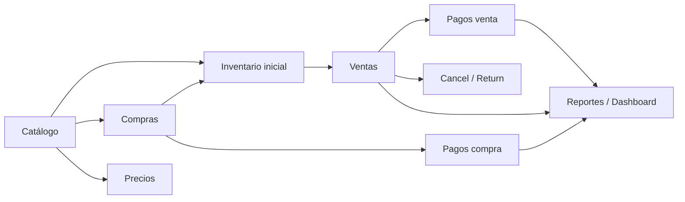

# Guía Frontend — API y flujos

Referencia operativa para conectar pantallas, hooks y componentes contra la capa BFF (`/api`). El frontend **no** llama Supabase directamente para datos de negocio; solo usa `/api` (cookies de sesión en rutas protegidas).

**Catálogo completo por módulo (rutas, hooks, campos, tablas):** [`modules-catalog.md`](modules-catalog.md)

Documentos relacionados:

- Contrato detallado de endpoints: [`mock-api-endpoints.md`](mock-api-endpoints.md)
- OpenAPI interactivo: `/api-docs` o [`public/openapi.yml`](../public/openapi.yml)
- Permisos por rol: [`auth-permissions.md`](auth-permissions.md)
- Checklist de integración UI: [`frontend-integration-checklist.md`](frontend-integration-checklist.md)
- Flujos validados en backend: [`backend-e2e-bodegon.md`](backend-e2e-bodegon.md)
- Arquitectura BFF: [`server-side-api-strategy.md`](server-side-api-strategy.md)

## Rutas de entrada

| Ruta | Comportamiento actual | Notas |
|------|----------------------|-------|
| `/` | Redirige a `/dashboard` o `/login` según sesión | [`src/app/page.tsx`](../src/app/page.tsx) (server) |
| `/login` | Formulario de acceso | Público; `useLogin` → BFF |
| `/dashboard` | Panel principal | `dashboard.view` en layout |
| `/dev/welcome` | Referencia demo | Solo desarrollo |

Rutas privadas: cada `page.tsx` usa `AuthenticatedAppShell` con `requiredPermission`. Además [`src/proxy.ts`](../src/proxy.ts) redirige a login si no hay sesión (salvo `ALLOW_DEMO_AUTH=true`).

Rutas públicas: `/login`, `/api-docs`, `/dev/*`, assets estáticos.

## Arquitectura en una línea

```text
Página / componente  →  hook use* (TanStack Query)  →  apiFetch("/api/...")  →  Route Handler  →  Supabase / RPC
```

Reglas:

1. Los componentes importan hooks, no `fetch` suelto ni clientes Supabase de negocio.
2. Las mutaciones invalidan las queries que cambian (ver tablas por módulo).
3. Los permisos de UI se basan en el perfil del usuario; el backend vuelve a validar (401/403).

## Cliente HTTP: `apiFetch`

Ubicación: [`src/shared/api/apiFetch.ts`](../src/shared/api/apiFetch.ts)

```ts
import { apiFetch, ClientApiError } from "@/shared/api/apiFetch";

// GET con filtros
const page = await apiFetch<PaginatedList<Product>>("/api/products", {
  query: { search: "Arroz", isActive: true },
});

// POST con body JSON
const sale = await apiFetch<Sale>("/api/sales", {
  method: "POST",
  body: { customerId, items, refRateVes },
});
```

Comportamiento:

| Aspecto | Detalle |
|---------|---------|
| Respuesta OK | Devuelve `payload.data` (el wrapper `{ data }` se oculta) |
| Error | Lanza `ClientApiError` con `status`, `code`, `message`, `issues?` |
| Query params | Objeto `query`; omite `null`, `undefined` y strings vacíos |
| Body | Objetos se serializan a JSON; `FormData` se envía tal cual |
| Cookies | `fetch` same-origin incluye cookies de sesión automáticamente |
| Dev demo | Si hay rol en `localStorage`, envía `x-demo-role` y `x-demo-user-id` |

Manejo de errores en UI:

```ts
try {
  await createSale.mutateAsync(input);
} catch (error) {
  if (error instanceof ClientApiError) {
    if (error.status === 409) { /* SKU / taxId duplicado */ }
    if (error.status === 403) { /* sin permiso */ }
    if (error.status === 400) { /* validación Zod o regla de negocio */ }
  }
}
```

Códigos frecuentes: `400` entrada inválida, `401` sin sesión, `403` sin permiso, `404` no encontrado, `409` conflicto (unicidad).

## Listados paginados

Todos los endpoints de listado devuelven:

```json
{
  "data": {
    "items": [ /* registros de la página */ ],
    "skip": 0,
    "limit": 10,
    "total": 42
  }
}
```

Convenciones:

| Concepto | Detalle |
|----------|---------|
| Tipo | `PaginatedList<T>` en [`src/lib/api/pagination.ts`](../src/lib/api/pagination.ts) |
| Defaults | `skip=0`, `limit=10`, máximo `limit=100` |
| Hooks | Tipar respuesta como `PaginatedList<T>`, no `T[]` |
| UI | Extraer filas con `getPaginatedItems(data)` del mismo módulo |
| Componente | [`Pagination`](../src/shared/components/Pagination/Pagination.tsx) — listo en Storybook/Jest |

Estado de integración UI:

- `[x]` Hooks y páginas consumen `data.items` (no tratan `data` como array).
- `[x]` Hooks envían `skip` y `limit` en query params.
- `[x]` Páginas listado renderizan `<Pagination />` con `usePaginationState`.

Ejemplo objetivo en un listado:

```tsx
const [skip, setSkip] = useState(0);
const [limit, setLimit] = useState(10);
const products = useProducts({ ...filters, skip, limit });

<DataTable data={getPaginatedItems(products.data)} /* ... */ />
<Pagination
  limit={limit}
  onLimitChange={setLimit}
  onSkipChange={setSkip}
  skip={products.data?.skip ?? skip}
  total={products.data?.total ?? 0}
/>
```

## Autenticación y permisos

### Estado actual (julio 2026)

| Pieza | Estado |
|-------|--------|
| Entrada `/` | Redirect server en `src/app/page.tsx` |
| Login UI + BFF | `useLogin` → `POST /api/auth/login` |
| Logout | `useLogout` → `POST /api/auth/logout` |
| Perfil | `useCurrentUser` → `GET /api/auth/me` |
| Shell | `AuthenticatedAppShell` + `requiredPermission` por página |
| 401 global | `query-client.ts` → `/login` |
| Tasa header | `useCurrentExchangeRate` en shell |
| Pendiente | MFA (proxy de sesión ya en `src/proxy.ts`) |

### Hooks auth

| Hook | Endpoint |
|------|----------|
| `useLogin` | `POST /api/auth/login` |
| `useLogout` | `POST /api/auth/logout` |
| `useCurrentUser` | `GET /api/auth/me` |

Respuesta de `GET /api/auth/me`:

```ts
{
  user: { id, email, name, isActive },
  role: UserRole,
  permissions: Permission[],
  grantedPermissions: Permission[],
  deniedPermissions: Permission[],
  permissionCatalog: Permission[],
  roles: UserRole[],
}
```

Detalle de flujo: [`auth-permissions.md`](auth-permissions.md).

### Modo demo (`ALLOW_DEMO_AUTH=true`)

En desarrollo, si no hay sesión real, la API puede aceptar headers demo. `apiFetch` los añade desde `localStorage`:

```js
localStorage.setItem("control-ventas:user-role", "vendedor");
location.reload();
```

Roles: `admin`, `vendedor`, `almacen`, `contador`. Ver matriz en [`auth-permissions.md`](auth-permissions.md).

**Producción:** `ALLOW_DEMO_AUTH=false`; solo cookies de sesión. No depender de `localStorage` para permisos.

### Permisos en componentes

```tsx
<AuthenticatedAppShell requiredPermission="sales.create">
  <SaleCreatePage />
</AuthenticatedAppShell>
```

La fuente de permisos efectivos está en `src/shared/auth/permissions.ts`. Tras `useCurrentUser`, leer `permissions` (efectivos) y opcionalmente `grantedPermissions` / `deniedPermissions` para overrides por usuario.

Rutas privadas actuales (cada `page.tsx` envuelve con `AuthenticatedAppShell`):

```text
/dashboard, /products, /sales, /purchases, /inventory,
/contacts, /payments, /reports, /settings
```

Sin sesión, la API responde 401 y el cliente redirige a `/login`. En dev con demo headers, la API puede aceptar `x-demo-role`.

## Módulos (resumen)

Cada módulo vive en `src/modules/<dominio>/` con carpetas por página (screaming architecture). Ver detalle en [`modules-catalog.md`](modules-catalog.md).

| Módulo | Hooks principales | Rutas app |
|--------|-------------------|-----------|
| Dashboard | `useDashboard*` | `/dashboard` |
| Productos | `useProducts`, `useProduct*`, import | `/products`, `/products/[id]`, `/products/import` |
| Inventario | `useInventory`, `useInventoryMovements`, `useAdjustInventory` | `/inventory`, `/inventory/movements` |
| Contactos | `useContacts`, `useContact*` | `/contacts`, `/contacts/[id]` |
| Ventas | `useSales`, `useSale*`, `useCreateSale` | `/sales`, `/sales/create`, `/sales/[id]` |
| Compras | `usePurchases`, `usePurchase*`, `useReceivePurchase` | `/purchases`, `/purchases/create`, `/purchases/[id]` |
| Pagos | `usePayments`, `usePayment`, `useCreatePayment` | `/payments`, `/payments/[id]` |
| Reportes | `use*Report` (10 hooks) | `/reports` |
| Settings | `useSettings`, `useUsers`, `useExchangeRates` | `/settings` |

## Convenciones TanStack Query

### Query keys

Cada módulo exporta un objeto `*QueryKeys` con `all`, `list(filters)`, `detail(id)`, etc. Ejemplo ventas:

```ts
salesQueryKeys.list({ status: "pendiente_pago" })
salesQueryKeys.detail(saleId)
```

Incluir **filtros e ids** en la key para que el cache sea correcto.

### Hooks por módulo

| Módulo | Archivo hooks |
|--------|---------------|
| Dashboard | [`src/modules/dashboard/hooks/useDashboard.ts`](../src/modules/dashboard/hooks/useDashboard.ts) |
| Productos / categorías | [`src/modules/products/hooks/useProducts.ts`](../src/modules/products/hooks/useProducts.ts) |
| Inventario | [`src/modules/inventory/hooks/useInventory.ts`](../src/modules/inventory/hooks/useInventory.ts) |
| Contactos | [`src/modules/contacts/hooks/useContacts.ts`](../src/modules/contacts/hooks/useContacts.ts), [`useSupplierProducts.ts`](../src/modules/contacts/hooks/useSupplierProducts.ts), [`useSupplierProductMutations.ts`](../src/modules/contacts/hooks/useSupplierProductMutations.ts) |
| Ventas | [`src/modules/sales/hooks/useSales.ts`](../src/modules/sales/hooks/useSales.ts) |
| Compras | [`src/modules/purchases/hooks/usePurchases.ts`](../src/modules/purchases/hooks/usePurchases.ts) |
| Pagos | [`src/modules/payments/hooks/usePayments.ts`](../src/modules/payments/hooks/usePayments.ts) |
| Reportes | [`src/modules/reports/hooks/useReports.ts`](../src/modules/reports/hooks/useReports.ts) |
| Settings / usuarios / tasas | [`src/modules/settings/hooks/useSettings.ts`](../src/modules/settings/hooks/useSettings.ts), [`useCurrentExchangeRate.ts`](../src/modules/settings/hooks/useCurrentExchangeRate.ts) |

### Estados en UI

De cada hook usar:

- `isLoading` — primera carga
- `isFetching` — refetch en background
- `error` — mostrar `ErrorState` + reintentar
- `getPaginatedItems(data).length === 0` — empty state

Listados paginados: `{ items, skip, limit, total }`. Ver sección [Listados paginados](#listados-paginados).

## Mapa hook → endpoint

### Dashboard

| Hook | Método | Endpoint | Permiso |
|------|--------|----------|---------|
| `useDashboardSummary` | GET | `/api/dashboard/summary` | `dashboard.view` |
| `useDashboardMetrics` | GET | `/api/dashboard/metrics?from=&to=` | `dashboard.view` |
| `useDashboardRecentSales` | GET | `/api/dashboard/recent-sales` | `dashboard.view` |
| `useDashboardLowStock` | GET | `/api/dashboard/low-stock` | `dashboard.view` |

Invalidar `["dashboard"]` tras ventas, pagos, inventario.

### Productos y categorías

| Hook | Método | Endpoint | Permiso |
|------|--------|----------|---------|
| `useProducts` | GET | `/api/products?search=&categoryId=&isActive=` | `products.view` |
| `useProduct` | GET | `/api/products/[id]` | `products.view` |
| `useCreateProduct` | POST | `/api/products` | `products.manage` |
| `useUpdateProduct` | PATCH | `/api/products/[id]` | `products.manage` |
| `useUpdateProductPrice` | POST | `/api/products/[id]/price` | `products.manage` |
| `useProductPriceHistory` | GET | `/api/products/[id]/price-history` | `products.view` |
| `useProductSuppliers` | GET | `/api/products/[id]/suppliers` | `products.view` |
| `useCategories` | GET | `/api/categories` | `products.view` |

Invalidar `productsQueryKeys.all` tras crear/editar/precio. Crear producto con `currentStock: 0` y cargar stock vía inventario o compra.

**Importación masiva Excel:** ruta `/products/import`, hook `useProductBulkImport`. Ver [`frontend-product-bulk-import.md`](frontend-product-bulk-import.md).

### Inventario

| Hook | Método | Endpoint | Permiso |
|------|--------|----------|---------|
| `useInventory` | GET | `/api/inventory?lowStock=true` | `inventory.view` |
| `useInventoryMovements` | GET | `/api/inventory/movements?productId=` | `inventory.view` |
| `useStockCard` | GET | `/api/inventory/stock-card?productId=` | `inventory.view` |
| `useAdjustInventory` | POST | `/api/inventory/adjustments` | `inventory.manage` |

Tipos de ajuste: `inventario_inicial`, `ajuste_entrada`, `ajuste_salida`, `devolucion_cliente`, `devolucion_proveedor`.

Invalidar `inventoryQueryKeys.all` y `["products"]` si cambia stock visible en producto.

### Contactos

| Hook | Método | Endpoint | Permiso |
|------|--------|----------|---------|
| `useContacts` | GET | `/api/contacts?type=&search=` | `contacts.view` |
| `useContact` | GET | `/api/contacts/[id]` | `contacts.view` |
| `useCreateContact` | POST | `/api/contacts` | `contacts.manage` |
| `useUpdateContact` | PATCH | `/api/contacts/[id]` | `contacts.manage` |
| `useContactActivity` | GET | `/api/contacts/[id]/activity` | `contacts.view` |
| `useContactSales` | GET | `/api/contacts/[id]/sales` | `contacts.view` |
| `useContactPurchases` | GET | `/api/contacts/[id]/purchases` | `contacts.view` |
| `useContactPayments` | GET | `/api/contacts/[id]/payments` | `contacts.view` |

Tipos: `cliente`, `proveedor`, `ambos`. `taxId` duplicado → 409. **No hay DELETE** de contactos.

### Proveedor–producto

Hooks en `src/modules/contacts/hooks/` (modales compartidos en `contacts/components/supplier-products/`):

| Hook | Método | Endpoint | Permiso |
|------|--------|----------|---------|
| `useSupplierProducts` | GET | `/api/suppliers/[id]/products?isActive=` | `products.view` |
| `useProductSupplierProducts` | GET | `/api/products/[id]/suppliers` | `products.view` |
| `useCreateSupplierProduct` | POST | `/api/supplier-products` | `products.manage` |
| `useUpdateSupplierProductMetadata` | PATCH | `/api/supplier-products/[id]` | `products.manage` |
| `useRegisterSupplierPrice` | POST | `/api/supplier-products/[id]/prices` | `products.manage` |
| `useSupplierProductPriceHistory` | GET | `/api/supplier-products/[id]/price-history` | `products.view` |
| `useDeactivateSupplierProduct` | PATCH | `/api/supplier-products/[id]/deactivate` | `products.manage` |

`usePurchases` re-exporta `useSupplierProducts` con `isActive=true` por defecto para catálogo OC.

UI: tab **Productos** en `/contacts/[id]` (proveedor/ambos), sección proveedores en `/products/[id]`, modales M10–M14 (M10: autocomplete producto o proveedor; historial M14 como Modal `sm:max-w-3xl`).

### Compras

| Hook | Método | Endpoint | Permiso |
|------|--------|----------|---------|
| `usePurchases` | GET | `/api/purchases?status=&supplierId=&from=&to=` | `purchases.view` |
| `usePurchase` | GET | `/api/purchases/[id]` | `purchases.view` |
| `useCreatePurchase` | POST | `/api/purchases` | `purchases.create` |
| `useCancelPurchase` | PATCH | `/api/purchases/[id]/cancel` | `purchases.create` |
| `useReturnPurchase` | POST | `/api/purchases/[id]/return` | `purchases.create` |
| `useReceivePurchase` | PATCH | `/api/purchases/[id]/receive` | `purchases.create` |

Body `POST /api/purchases`:

```json
{
  "supplierId": "uuid-proveedor",
  "status": "recibido",
  "items": [{ "productId": "uuid", "quantity": 10, "unitCostRef": 2.5 }],
  "discountRef": 0,
  "taxRef": 0,
  "refRateVes": 48.0,
  "exchangeRateId": "uuid-opcional",
  "notes": "..."
}
```

- `status: "recibido"` — entra stock de inmediato (RPC `create_purchase`).
- `status: "pedido"` — sin stock; luego `PATCH .../receive`.

Tras crear/recibir/cancelar/devolver: invalidar `purchases`, `inventory`, `products`, `contacts`, `dashboard`, `reports`.

### Ventas

| Hook | Método | Endpoint | Permiso |
|------|--------|----------|---------|
| `useSales` | GET | `/api/sales?status=&customerId=&from=&to=` | `sales.view` |
| `useSale` | GET | `/api/sales/[id]` | `sales.view` |
| `useSaleReceipt` | GET | `/api/sales/[id]/receipt` | `sales.view` |
| `useCreateSale` | POST | `/api/sales` | `sales.create` |
| `useCancelSale` | PATCH | `/api/sales/[id]/cancel` | `sales.create` |
| `useReturnSale` | POST | `/api/sales/[id]/return` | `sales.create` |

Body `POST /api/sales`:

```json
{
  "customerId": "uuid-cliente",
  "items": [{ "productId": "uuid", "quantity": 2 }],
  "discountRef": 0,
  "taxRef": 0,
  "refRateVes": 48.0,
  "exchangeRateId": "uuid-opcional",
  "notes": "..."
}
```

Antes de enviar: comprobar stock (`GET /api/products/[id]` o listado inventario). Cantidad > stock → 400/409.

Estados típicos: `pendiente_pago`, `pagada`, `cancelada`. El detalle incluye `items` y `payments`.

**UI POS (`/sales/create`):** componentes en `src/modules/sales/sale-create/components/`:

| Componente | Rol |
|------------|-----|
| `PosProductGrid` / `PosProductCard` | Catálogo clickeable; precio REF + VES por producto |
| `PosCartPanel` / `PosCartLine` | Carrito; cada línea muestra unitario y total en REF y VES |
| `usePosCart` | Estado local del carrito antes de `useCreateSale` |

La tasa viene de `useCurrentExchangeRate` (`rateVes`); conversiones con `refToVes` / `formatVes`. Si no hay tasa (`rateVes === 0`), la UI muestra solo montos REF.

### Pagos

| Hook | Método | Endpoint | Permiso |
|------|--------|----------|---------|
| `usePayments` | GET | `/api/payments?direction=&saleId=&purchaseId=&contactId=` | `payments.view` |
| `usePayment` | GET | `/api/payments/[id]` | `payments.view` |
| `useCreatePayment` | POST | `/api/payments` | `payments.manage` |

Body común:

```json
{
  "saleId": "uuid",
  "method": "pago_movil",
  "amount": 500,
  "currency": "VES",
  "bankName": "Banesco",
  "phone": "04141234567",
  "referenceCode": "1234"
}
```

Reglas:

- Exactamente uno de `saleId` o `purchaseId`.
- Respuesta incluye `pendingBalanceVes` respecto al total de la venta/compra.
- Varios pagos parciales hasta cubrir el total; la venta puede pasar a `pagada`.

| Método | Campos obligatorios |
|--------|---------------------|
| `efectivo_ves` | `amount`, `currency: "VES"` |
| `efectivo_usd` | `amount`, `currency: "USD"` |
| `pago_movil` | `bankName`, `phone`, `referenceCode` (4 dígitos) |
| `transferencia` | `bankName`, `referenceCode` |
| `punto_venta` | `referenceCode` opcional |

`useCreatePayment` invalida: `payments`, `sales`, `purchases`, `contacts`, `dashboard`, `reports`.

### Tasas ref/VES

| Hook | Método | Endpoint | Permiso |
|------|--------|----------|---------|
| `useCurrentExchangeRate` | GET | `/api/exchange-rates/current` | `dashboard.view` |
| `useExchangeRates` | GET | `/api/exchange-rates?from=&to=` | `dashboard.view` |
| `useCreateExchangeRate` | POST | `/api/exchange-rates` | `payments.manage` |

En formularios de venta/compra: leer tasa vigente con `useCurrentExchangeRate` y enviar `refRateVes` (o `exchangeRateId` si se captura el id del POST). Mostrar totales VES en UI con la misma tasa que se enviará al guardar.

### Settings y usuarios

| Hook | Método | Endpoint | Permiso |
|------|--------|----------|---------|
| `useSettings` | GET | `/api/settings` | `settings.view` |
| `useUpdateSettings` | PATCH | `/api/settings` | `users.manage` |
| `useUsers` | GET | `/api/users` | `users.manage` |
| `useUpdateUser` | PATCH | `/api/users/[id]` | `users.manage` |

### Reportes

Todos GET, permiso `reports.view`. Pasar `from` / `to` donde aplique; `stock-card` y reporte inventario requieren `productId`.

| Hook | Endpoint |
|------|----------|
| `useDailySalesReport` | `/api/reports/daily-sales` |
| `useGrossProfitReport` | `/api/reports/gross-profit` |
| `useProductProfitabilityReport` | `/api/reports/product-profitability` |
| `useLowStockReport` | `/api/reports/low-stock` |
| `useCustomerPurchasesReport` | `/api/reports/customer-purchases` |
| `useSupplierPurchasesReport` | `/api/reports/supplier-purchases` |
| `useStockCardReport` | `/api/reports/stock-card?productId=` |
| `useTopProductsReport` | `/api/reports/top-products?from=&to=` |
| `useTopCustomersReport` | `/api/reports/top-customers?from=&to=` |
| `usePurchasesReport` | `/api/reports/purchases?supplierId=&from=&to=` |

## Flujos de negocio (orden recomendado)

Diagrama de dependencias (mismo orden que E2E backend):



### 1. Alta de catálogo

1. `POST /api/categories` (si no existen).
2. `POST /api/products` con `currentStock: 0`.
3. Opcional: `POST /api/contacts` proveedor + `POST /api/supplier-products`.

Pantallas: `/products`, modal crear, `/contacts`.

### 2. Stock inicial

1. Por cada SKU: `POST /api/inventory/adjustments` con `type: "inventario_inicial"`, `quantityDelta` positivo.
2. Verificar: `GET /api/inventory`, `GET /api/inventory/stock-card?productId=`.

Pantalla: `/inventory` → modal ajuste.

### 3. Compra a proveedor

1. Login rol `almacen` o `admin`.
2. `GET /api/exchange-rates/current` → guardar `refRateVes`.
3. `GET /api/contacts?type=proveedor` + `GET /api/suppliers/[id]/products` (costos sugeridos).
4. `POST /api/purchases` con `status: "recibido"` **o** `"pedido"`.
5. Si `pedido`: botón “Recibir” → `PATCH /api/purchases/[id]/receive`.
6. Pagos pendientes: ver flujo 5.

Pantallas: `/purchases`, `/purchases/create`, `/purchases/[id]`.

### 4. Venta a cliente

1. Login rol `vendedor` o `admin`.
2. Tasa vigente → `refRateVes` en el body.
3. `GET /api/contacts?type=cliente` + `GET /api/products` (stock y precio).
4. Validar cantidades ≤ stock en cliente antes de submit.
5. `POST /api/sales` → navegar a detalle con id retornado.
6. Registrar pagos (flujo 5) o dejar `pendiente_pago`.

Pantallas: `/sales/create`, `/sales/[id]`.

### 5. Registrar pago (venta o compra)

1. Rol `contador` o `admin`.
2. Desde detalle venta/compra: leer saldo (`pendingVes` en recibo o calcular desde total − pagos).
3. `POST /api/payments` con método adecuado.
4. Refetch venta/compra: estado puede cambiar a `pagada`.
5. Pagos parciales: repetir hasta `pendingBalanceVes === 0`.

Pantallas: detalle venta/compra, `/payments`, modal registrar pago.

### 6. Cancelar / devolver

| Acción | Endpoint | Efecto |
|--------|----------|--------|
| Cancelar venta | `PATCH /api/sales/[id]/cancel` | Estado cancelada; reglas RPC |
| Devolver venta | `POST /api/sales/[id]/return` | Restock parcial/total |
| Cancelar compra | `PATCH /api/purchases/[id]/cancel` | Según estado |
| Devolver compra | `POST /api/purchases/[id]/return` | Salida de stock |
| Ajuste manual | `POST /api/inventory/adjustments` | `devolucion_cliente`, etc. |

Invalidar ventas/compras/inventario/dashboard/reportes.

### 7. Cambio de precio

1. `POST /api/products/[id]/price` con nuevo `salePriceRef`.
2. `GET /api/products/[id]/price-history` para historial.
3. Ventas nuevas usan precio actual; items históricos conservan `unitPriceRef` del momento.

### 8. Dashboard y reportes

Solo lectura tras tener ventas/compras/pagos. Usar rango de fechas coherente (`from`, `to` ISO date).

## Matriz rol → acción (casos UI)

| Acción | admin | vendedor | almacen | contador |
|--------|-------|----------|---------|----------|
| Crear venta | Sí | Sí | **403** | No |
| Crear compra | Sí | **403** | Sí | No |
| Ajustar inventario | Sí | No | Sí | No |
| Registrar pago | Sí | No* | No | Sí |
| Ver reportes | Sí | No | No | Sí |
| Gestionar usuarios | Sí | **403** | No | No |

\* Vendedor tiene `payments.view` pero no `payments.manage`.

Ocultar botones si el permiso no está en el perfil; igual manejar 403 del API.

## Pantalla → hooks principales

| Ruta | Hooks |
|------|-------|
| `/dashboard` | `useDashboardSummary`, `useDashboardMetrics`, `useDashboardRecentSales`, `useDashboardLowStock` |
| `/products` | `useProducts`, `useCategories`, `useCreateProduct`, `useUpdateProduct` |
| `/products/[id]` | `useProduct`, `useProductPriceHistory`, `useProductSuppliers`, `useUpdateProductPrice`, mutaciones M10–M14 |
| `/inventory` | `useInventory`, `useAdjustInventory` |
| `/inventory/movements` | `useInventoryMovements`, `useStockCard` |
| `/contacts` | `useContacts`, `useCreateContact` |
| `/contacts/[id]` | `useContact`, `useContactActivity`, `useContactSales`, `useContactPurchases`, `useContactPayments`, `useSupplierProducts`, mutaciones M10–M13 |
| `/sales` | `useSales` |
| `/sales/create` | `useCreateSale`, `useContacts`, `useProducts`, `useCurrentExchangeRate` |
| `/sales/[id]` | `useSale`, `useSaleReceipt`, `useCancelSale`, `useReturnSale`, `useCreatePayment` |
| `/purchases` | `usePurchases` |
| `/purchases/create` | `useCreatePurchase`, `useSupplierProducts`, `useCurrentExchangeRate` |
| `/purchases/[id]` | `usePurchase`, `useCancelPurchase`, `useReturnPurchase`, `useCreatePayment` |
| `/payments` | `usePayments` |
| `/payments/[id]` | `usePayment` |
| `/reports/*` | hooks en `useReports.ts` según reporte |
| `/settings` | `useSettings`, `useUpdateSettings`, `useUsers`, `useUpdateUser`, `useExchangeRates`, `useCreateExchangeRate` |
| `/dev/welcome` | — (pantalla estática de referencia) |

## Gaps conocidos

| Gap | Impacto UI | Prioridad | Workaround |
|-----|------------|-----------|------------|
| Sin `DELETE` contactos | Baja vía PATCH `isActive: false` | Baja | `useUpdateContact({ isActive: false })` |
| Baja proveedor-producto | `PATCH .../deactivate` (no DELETE) | Baja | `useDeactivateSupplierProduct` |
| Sin `PATCH /api/payments/[id]/cancel` | Anular pago deshabilitado en UI | Baja | Botón disabled documentado |
| PATCH notas venta/pago | RLS puede exigir admin | Baja | Mostrar error o usar rol admin |
| Permisos en botones (cobertura parcial) | Algunas pantallas aún sin `Can` | Media | Extender `usePermission` / `<Can>` |
| Export reportes PDF/Excel | Fuera de MVP | Baja | — |
| Jest route tests con `API_DATA_SOURCE=supabase` | Suites API esperan mock | Baja | `API_DATA_SOURCE=mock npm test` en CI local |

## Checklist al integrar una pantalla

1. Usar hooks del módulo, no fetch inline.
2. Mapear filtros UI → query params del hook.
3. En listados: tipar `PaginatedList<T>`, usar `getPaginatedItems`, añadir paginación cuando aplique.
4. Mostrar loading / error / empty.
5. Tras mutación, confiar en `onSuccess` del hook o invalidar keys adicionales si la pantalla lo requiere.
6. Capturar `ClientApiError` en formularios (409, 400, 403).
7. Probar con al menos dos roles (permiso concedido y denegado).
8. En ventas/compras, incluir `refRateVes` de `useCurrentExchangeRate`.
9. Ocultar acciones según permisos del perfil (cuando exista `useCurrentUser`).
10. Actualizar [`frontend-integration-checklist.md`](frontend-integration-checklist.md) al cerrar el bloque.

## Referencia rápida de prueba manual

Con dev server y seed (`admin@example.com` / `Admin123!`):

```bash
npm run dev
npm run e2e:bodegon   # valida todos los flujos backend; ver scripts/e2e-bodegon/phases.ts
```

Para probar un hook desde la UI, abrir la ruta correspondiente con el rol adecuado en `localStorage` o tras login real.
