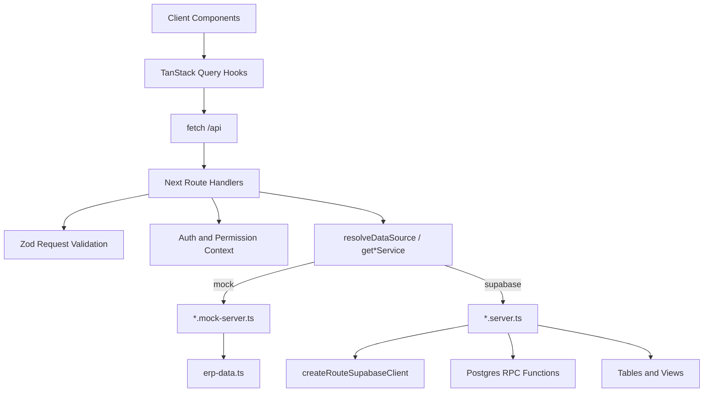

# Estrategia Server-Side API

**Catálogo por módulo:** [`modules-catalog.md`](modules-catalog.md)

Este documento define como mover el acceso a Supabase al lado servidor de Next.js. El cliente de la aplicacion consumira endpoints internos en `/api`, y esos endpoints seran los unicos responsables de hablar con Supabase para datos de negocio.

## Objetivo

- Evitar llamadas directas a Supabase desde componentes, hooks o servicios cliente.
- Usar Route Handlers de Next.js en `src/app/api/**/route.ts` como backend-for-frontend.
- Mantener TanStack Query en el cliente para cache, estados de carga, errores e invalidacion.
- Mantener las operaciones criticas en RPC de PostgreSQL, tal como define `supabase-schema.sql`.
- Preparar el camino para Supabase Auth real sin bloquear el avance actual con mock local.

## Estado Actual

- Route Handlers operativos en `src/app/api/**` para todos los modulos del ERP.
- `API_DATA_SOURCE` alterna mock (tests) y Supabase (runtime); ver `src/lib/api/dataSource.ts`.
- Servicios `.server.ts` implementados por modulo; mocks conservados para tests unitarios.
- Auth BFF: `POST /api/auth/login`, `POST /api/auth/logout`, `GET /api/auth/me` con cookies Supabase.
- `requirePermission` carga perfil desde sesion o headers demo (`ALLOW_DEMO_AUTH`).
- `supabase/supabase-schema.sql` define tablas, RLS, vistas y RPC transaccionales ya conectados en servicios server.
- Pendiente: migrar hooks/pantallas cliente para consumir `/api` en lugar de mocks locales.
- Guia frontend (hooks, flujos, invalidaciones): [`docs/frontend-api-guide.md`](frontend-api-guide.md).

## Flujo Objetivo



## Reglas De Arquitectura

1. Los componentes no llaman Supabase directamente.
2. Los hooks cliente llaman endpoints `/api` con `fetch`.
3. Los Route Handlers validan request, auth/permisos y delegan a servicios.
4. Los servicios server contienen el acceso a Supabase, RPC y transformaciones de datos.
5. Las escrituras transaccionales usan RPC cuando exista una funcion en el schema.
6. Las lecturas pesadas o reportes usan vistas SQL.
7. `shared` solo debe contener helpers realmente transversales.

## Ubicacion De Archivos

Route Handlers, obligatoriamente en App Router:

```text
src/app/api/sales/route.ts
src/app/api/sales/[id]/route.ts
src/app/api/products/route.ts
src/app/api/inventory/adjustments/route.ts
```

Servicios server por dominio:

```text
src/modules/sales/services/listSales.server.ts
src/modules/sales/services/createSale.server.ts
src/modules/products/services/listProducts.server.ts
src/modules/inventory/services/adjustStock.server.ts
```

Hooks cliente por pagina o modulo:

```text
src/modules/sales/sales-list/hooks/useSalesList.ts
src/modules/sales/sale-create/hooks/useCreateSale.ts
src/modules/products/products-list/hooks/useProductsList.ts
```

Helpers compartidos solo si cruzan modulos:

```text
src/lib/api/handleApiError.ts
src/lib/api/jsonResponse.ts
src/lib/api/requirePermission.ts
src/lib/supabase/server-client.ts
```

## Patron De Route Handler

Los handlers deben ser delgados: parsean entrada, validan permisos, llaman un servicio y devuelven JSON.

```ts
import { NextRequest } from "next/server";

import { listSales } from "@/modules/sales/services/listSales.server";
import { requirePermission } from "@/lib/api/requirePermission";

export async function GET(request: NextRequest) {
  const auth = await requirePermission("sales.view");
  const searchParams = request.nextUrl.searchParams;
  const data = await listSales({ auth, searchParams });

  return Response.json({ data });
}
```

Reglas:

- Usar `NextRequest` cuando se necesiten query params, cookies o headers.
- Usar `Response.json`.
- No hacer queries complejas dentro del `route.ts`.
- No retornar errores crudos de Supabase al cliente.
- Validar cuerpos `POST`, `PUT` y `PATCH` con Zod antes de llamar servicios.

## Patron De Servicio Server

Los servicios server son responsables de hablar con Supabase.

```ts
import { createServerSupabaseClient } from "@/lib/supabase/server-client";

export async function createSale(input: CreateSaleInput) {
  const supabase = await createServerSupabaseClient();
  const { data, error } = await supabase.rpc("create_sale", {
    p_customer_id: input.customerId,
    p_items: input.items,
    p_exchange_rate_id: input.exchangeRateId,
    p_ref_rate_ves: input.refRateVes,
    p_discount_ref: input.discountRef,
    p_tax_ref: input.taxRef,
    p_notes: input.notes,
    p_invoice_number: input.invoiceNumber,
  });

  if (error) {
    throw error;
  }

  return data;
}
```

Reglas:

- Usar `.server.ts` para señalar que no debe importarse desde cliente.
- Usar RPC para ventas, compras, pagos, ajustes de stock y cambios de precio.
- Usar queries directas solo para lecturas simples y CRUD no transaccional.
- Centralizar el mapeo de snake_case a camelCase cuando sea necesario.

## Patron De Hook Cliente

Los hooks cliente consumen `/api`; no importan Supabase ni servicios `.server.ts`.

```ts
import { useQuery } from "@tanstack/react-query";

export function useSalesList(filters: SalesListFilters) {
  return useQuery({
    queryKey: ["sales", "list", filters],
    queryFn: async () => {
      const response = await fetch(`/api/sales?${new URLSearchParams(filters)}`);

      if (!response.ok) {
        throw new Error("No se pudieron cargar las ventas.");
      }

      const payload = await response.json();
      return payload.data;
    },
  });
}
```

Reglas:

- `queryKey` debe incluir filtros, ids y rangos.
- Las mutaciones deben invalidar queries relacionadas.
- La UI maneja loading, error y empty state.
- Los hooks no conocen detalles de tablas ni RPC.

## Cliente Supabase Server

Cliente server en `src/lib/supabase/route-client.ts` (`createRouteSupabaseClient`).

Comportamiento:

- Route Handlers leen sesion desde cookies via `@supabase/ssr`.
- `requirePermission` carga `profiles.role`, `profiles.is_active` y overrides.
- RLS es la autoridad final de datos.
- `API_DATA_SOURCE=mock` fuerza servicios mock (tests); `supabase` es el default fuera de `NODE_ENV=test`.
- Header `x-demo-role` solo en dev cuando `ALLOW_DEMO_AUTH=true`.

Uso de `SUPABASE_SERVICE_ROLE_KEY`:

- Permitido solo para tareas administrativas controladas.
- Nunca debe exponerse al navegador.
- Si se usa, el endpoint debe validar permisos antes de ejecutar la accion.

## Permisos

La matriz base vive en `src/shared/auth/permissions.ts` y esta documentada en `docs/auth-permissions.md`.

Roles actuales:

- `admin`
- `vendedor`
- `almacen`
- `contador`

El rol es la plantilla base, pero los usuarios pueden tener permisos concedidos o bloqueados de forma individual. Cada endpoint debe declarar el permiso requerido:

```text
GET /api/sales             -> sales.view
POST /api/sales            -> sales.create
GET /api/products          -> products.view
PATCH /api/products/[id]   -> products.manage
POST /api/payments         -> payments.manage
GET /api/reports/sales     -> reports.view
```

## Endpoints Iniciales

| Modulo | Endpoint | Metodo | Permiso | Supabase |
| --- | --- | --- | --- | --- |
| Productos | `/api/products` | `GET` | `products.view` | `products`, `categories` |
| Productos | `/api/products` | `POST` | `products.manage` | `products` |
| Productos | `/api/products/[id]` | `PATCH` | `products.manage` | `products` |
| Inventario | `/api/inventory/movements` | `GET` | `inventory.view` | `stock_movements` |
| Inventario | `/api/inventory/adjustments` | `POST` | `inventory.manage` | RPC `adjust_stock` |
| Ventas | `/api/sales` | `GET` | `sales.view` | `sales`, `sale_items` |
| Ventas | `/api/sales` | `POST` | `sales.create` | RPC `create_sale` |
| Ventas | `/api/sales/[id]` | `GET` | `sales.view` | `sales`, `sale_items`, `payments` |
| Compras | `/api/purchases` | `GET` | `purchases.view` | `purchases`, `purchase_items` |
| Compras | `/api/purchases` | `POST` | `purchases.create` | RPC `create_purchase` |
| Compras | `/api/purchases/[id]` | `GET` | `purchases.view` | `purchases`, `purchase_items`, `payments` |
| Contactos | `/api/contacts` | `GET` | `contacts.view` | `contacts` |
| Contactos | `/api/contacts` | `POST` | `contacts.manage` | `contacts` |
| Contactos | `/api/contacts/[id]` | `PATCH` | `contacts.manage` | `contacts` |
| Pagos | `/api/payments` | `GET` | `payments.view` | `payments` |
| Pagos | `/api/payments` | `POST` | `payments.manage` | RPC `register_payment` |
| Reportes | `/api/reports/sales` | `GET` | `reports.view` | vistas SQL |
| Reportes | `/api/reports/inventory` | `GET` | `reports.view` | vistas SQL |
| Tasas | `/api/exchange-rates` | `GET` | `dashboard.view` | `exchange_rates` |
| Tasas | `/api/exchange-rates` | `POST` | `payments.manage` | `exchange_rates` |

Lista completa y actualizada: [`modules-catalog.md`](modules-catalog.md) y [`mock-api-endpoints.md`](mock-api-endpoints.md) (incluye proveedor-producto, cancel/return ventas-compras, import template, DolarAPI en `/exchange-rates/current`, etc.).

## RPC Del Schema

Usar estas funciones para operaciones atomicas:

- `update_product_price`: cambios de precio con historial.
- `adjust_stock`: ajustes manuales de inventario.
- `create_sale`: venta completa con items y descuento de stock.
- `create_purchase`: compra completa con items y entrada de stock.
- `register_payment`: pago de venta o compra con actualizacion de saldo/estado.
- `register_supplier_product_price`: cotizacion/ajuste de costo proveedor-producto + historial.
- `deactivate_supplier_product`: baja logica de relacion proveedor-producto.
- `cancel_sale` / `return_sale` / `cancel_purchase` / `return_purchase`: anulaciones y devoluciones con movimiento de stock.

Nota: `contacts.manage` separa la gestion de contactos de la lectura. Esto permite que un rol pueda ver clientes/proveedores sin poder cambiar datos fiscales o crear proveedores.

No crear directamente desde `/api`:

- `sale_items`
- `purchase_items`
- `stock_movements`
- `payments` cuando aplique a venta/compra

## Vistas Y Reportes

Los reportes deben apoyarse en vistas del schema para evitar recalcular agregados complejos en React.

Ejemplos de endpoints:

```text
GET /api/reports/daily-sales
GET /api/reports/gross-profit
GET /api/reports/product-profitability
GET /api/reports/customer-purchases
GET /api/reports/supplier-purchases
GET /api/reports/low-stock
GET /api/reports/stock-card?productId=...
```

## Manejo De Errores

Formato recomendado:

```json
{
  "error": {
    "code": "FORBIDDEN",
    "message": "No tienes permiso para realizar esta accion."
  }
}
```

Codigos HTTP:

- `200`: lectura exitosa.
- `201`: creacion exitosa.
- `400`: entrada invalida.
- `401`: no autenticado.
- `403`: sin permiso.
- `404`: recurso no encontrado.
- `409`: conflicto de negocio, por ejemplo SKU duplicado.
- `500`: error no esperado.

## Caching E Invalidacion

- Los Route Handlers de datos operativos deben ser dinamicos.
- El cliente usa TanStack Query para cache.
- Las mutaciones invalidan queries del modulo afectado.
- Evitar cache HTTP agresivo en ventas, compras, inventario, pagos y tasas.
- Reportes pueden cachearse en cliente por filtros y rango de fechas.

## Migracion Recomendada

1. ~~Crear helpers base: `jsonResponse`, `handleApiError`, `requirePermission`.~~ Hecho.
2. ~~Crear cliente Supabase server (`createRouteSupabaseClient`).~~ Hecho.
3. ~~Implementar endpoints de lectura simples: productos, contactos, tasas.~~ Hecho.
4. **En progreso:** migrar hooks cliente para consumir `/api`.
5. ~~Implementar endpoints RPC: ventas, compras, pagos, ajustes de stock.~~ Hecho.
6. ~~Implementar endpoints de reportes usando vistas.~~ Hecho.
7. ~~Auth Supabase con cookies en Route Handlers.~~ Hecho.
8. Revisar RLS contra `docs/auth-permissions.md` en entorno staging.
9. Smoke manual: `npx tsx scripts/smoke-api.ts` con dev server y credenciales.

## Criterios De Aceptacion — Backend Ready

El backend BFF se considera listo para integracion UI cuando:

- `[x]` Existen Route Handlers para modulos operativos (productos, contactos, inventario, ventas, compras, pagos, dashboard, reportes, settings).
- `[x]` Cada handler operativo enruta mock/Supabase via `resolveDataSource()` o factory de servicios.
- `[x]` Servicios `.server.ts` por modulo; ningun import de `browser-client` en `src/app/api/**` ni `*.server.ts`.
- `[x]` Escrituras criticas pasan por RPC donde aplica (`create_sale`, `create_purchase`, `register_payment`, `adjust_stock`, `update_product_price`).
- `[x]` Auth server-side con cookies; `requirePermission` integrado con perfiles Supabase.
- `[x]` Tests unitarios de handlers pasan con mock; contrato OpenAPI validado (`api-contract.test.ts`).
- `[x]` Documentacion sincronizada: checklist, guia backend, estrategia server-side.
- `[x]` Hooks cliente consumen `/api` en modulos operativos (ver `docs/modules-catalog.md`).
- `[x]` Datos de negocio no usan Supabase browser client; auth/login usa BFF.
- `[ ]` Tests de integracion automatizados contra Supabase local/staging.
